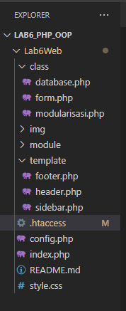
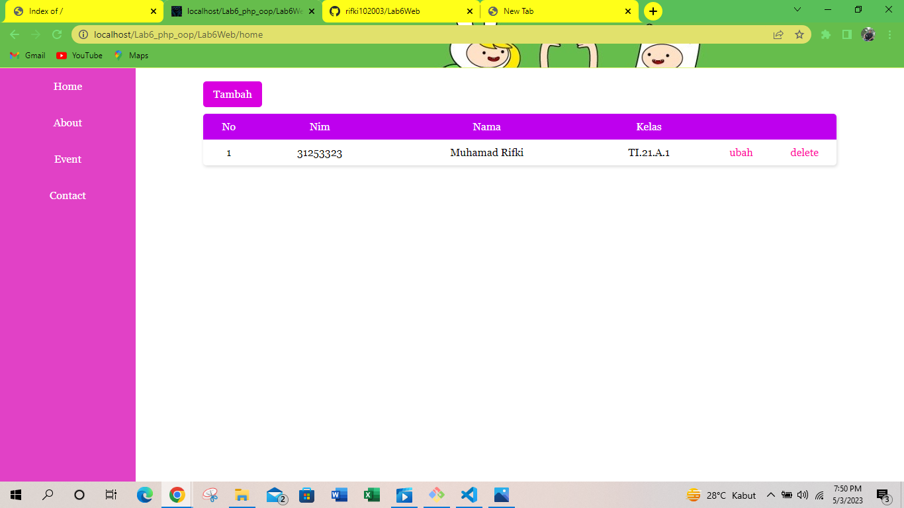
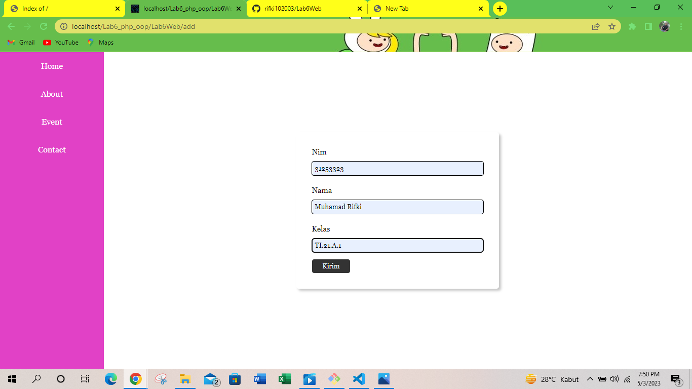
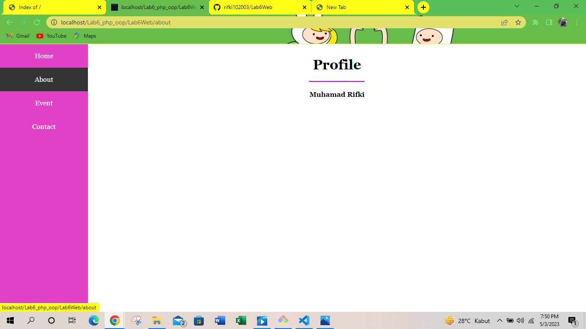
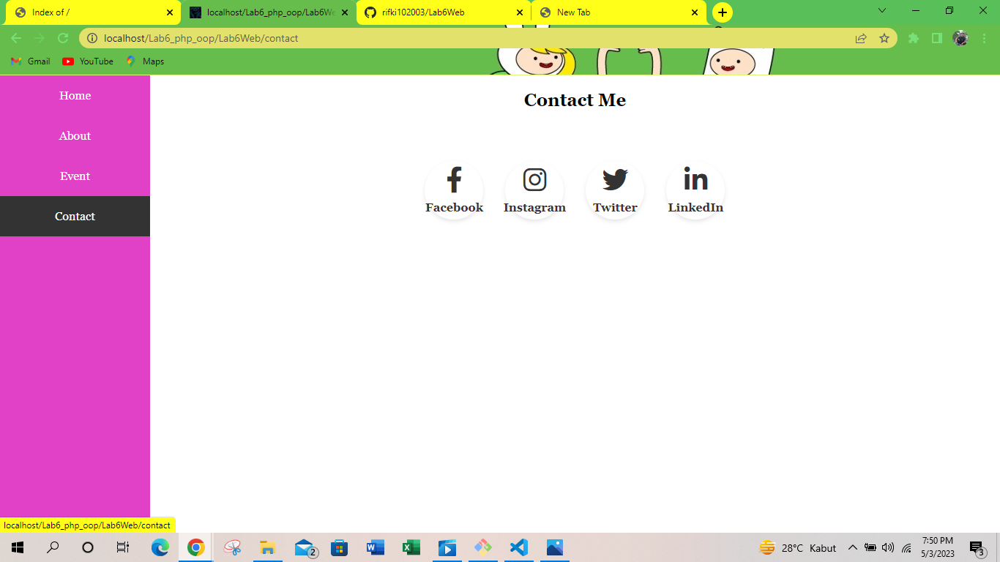

# Tugas Pemograman Web 2
## Profil
| #               | Biodata           |
| --------------- | ----------------- |
| **Nama**        | Muhamad Rifki     |
| **NIM**         | 311******         |
| **Kelas**       | TI.21.A.1         |
| **Mata Kuliah** | Pemrograman Web 2 |

# Praktikum 6 (OOP Lanjutan)
<p>Buat project baru dengan struktur sebagai berikut:</p>



- Copy file library (class) dari praktikum 5 dan letakkan pada folder class.
- Buat file template yang berisi template dan css untuk header, footer dan menu sidebar.
- Buat modul artikel yang berisi CRUD dengan memanfaatkan library database dan form tersbut.
- File index.php berisi proses routing aplikasi dan dikombinasikan dengan penggunaan mod_rewrite pada file .htaccess
# SELANJUTNYA
- Pertama, buatlah index.php untuk menampung semua class dan template yang akan dibuat. Caranya masukan kode berikut.
```php
<?php
require_once("class/modularisasi.php");
require_once("class/database.php");
require_once("template/header.php");
require_once("template/sidebar.php");
require_once("class/form.php");
$moduleName = strpos(@$_REQUEST["mod"], "/") ? str_split(@$_REQUEST["mod"], strpos(@$_REQUEST["mod"], "/"))[0] : @$_REQUEST['mod'];

$mod = [
    "home" => "module/home.php",
    "update" => "module/artikel/ubah.php",
    "about" => "module/artikel/tentang.php",
    "contact" => "module/artikel/kontak.php",
    "add" => "module/artikel/tambah.php",
    "delete" => "module/artikel/hapus.php",
    "error" => "module/artikel/error.php",
];

$moduleLoader = new Modularisasi($mod);
$moduleLoader->load($moduleName);
require_once("template/footer.php");
?>
```

- Kemudian, buatlah class config.php untuk koneksi ke database. dengan cara masukan kode berikut.
```php
<?php
class Config
{
    const host = 'localhost';
    const username = "root";
    const password = "";
    const database = "latihan1";
}
?>
```

## Class
- Buat file baru dengan nama database.php, kemudian masukan kode berikut.
```php
<?php
class Database
{
    protected $host;
    protected $user;
    protected $password;
    protected $db_name;
    protected $conn;

    public function __construct()
    {
        $this->getConfig();
        $this->conn = new mysqli(
            $this->host,
            $this->user,
            $this->password,
            $this->db_name
        );
        if ($this->conn->connect_error) {
            die("Connection failed: " . $this->conn->connect_error);
        }
    }
    private function getConfig()
    {
        include_once("config.php");
        $this->host = Config::host;
        $this->user = Config::username;
        $this->password = Config::password;
        $this->db_name = Config::database;
    }

    public function query($sql)
    {
        return $this->conn->query($sql);
    }

    public function gets($table)
    {
        $sql = "SELECT * FROM " . $table;
        $result = $this->conn->query($sql);
        $data = array();
        while ($row = $result->fetch_assoc()) {
            $data[] = $row;
        }
        return $data;
    }

    public function get($table, $where)
    {
        $sql = "SELECT * FROM " . $table . " " . $where;
        $sql = $this->conn->query($sql);
        $sql = $sql->fetch_assoc();
        return $sql;
    }

    public function insert($table, $data)
    {
        if (is_array($data)) {
            foreach ($data as $key => $val) {
                echo $key;
                $column[] = $key;
                $value[] = "'{$val}'";
            }
            $columns = implode(",", $column);
            $values = implode(",", $value);
        }
        $sql = "INSERT INTO " . $table . "(" . $columns . ") VALUES (" . $values . ")";
        $sql = $this->conn->query($sql);
        if ($sql == true) {
            return $sql;
        } else {
            return false;
        }
    }

    public function update($table, $data, $where)
    {
        $update_value = [];
        if (is_array($data)) {
            foreach ($data as $key => $val) {
                $update_value[] = "$key='{$val}'";
            }
            $update_value = implode(",", $update_value);
        }

        $sql = "UPDATE " . $table . " SET " . $update_value . " WHERE " . $where;
        $sql = $this->conn->query($sql);
        if ($sql == true) {
            return true;
        } else {
            return false;
        }
    }

    public function delete($table, $filter)
    {
        $sql = "DELETE FROM " . $table . " WHERE " . $filter;
        $sql = $this->conn->query($sql);
        if ($sql == true) {
            return true;
        } else {
            return false;
        }
    }
}
```

- Kemudian, buat file baru lagi dengan nama form.php, Untuk membuat form input lalu masukan kode berikut.
```php
<?php
class Form
{
    private $fields = [];
    private $action;
    private $submit;
    private $jumField = 0;
    public function __construct($action, $submit)
    {
        $this->action = $action;
        $this->submit = $submit;
    }
    public function displayForm()
    {
        echo '<div class="card">';
        echo "<form action='" . $this->action . "' method='POST'>";
        echo '<div class="input">';
        for ($j = 0; $j < count($this->fields); $j++) {
            echo '<div class="card-content">';
            echo "<label>" . $this->fields[$j]['label'] . "</label>";
            echo "<input type='text' value='" . $this->fields[$j]["value"] . "' name='" . $this->fields[$j]['name'] . "'required>";
            echo "</div>";
        }
        echo "</div>";
        echo "<button type='submit' name='" . $this->submit . "'>Kirim</button>";
        echo "</form>";
        echo "</div>";
    }
    public function addField($name, $label, $value = "")
    {
        $this->fields[$this->jumField]['name'] = $name;
        $this->fields[$this->jumField]['label'] = $label;
        $this->fields[$this->jumField]['value'] = $value;
        $this->jumField++;
    }
}
```

- Terakhir buatlah class bernama modularisasi.php, Lalu masukan kode berikut.
```php
<?php
class Modularisasi
{
    private $config = [];
    public function __construct($config)
    {
        $this->config = $config;
    }

    public function load($moduleName)
    {
        if (array_key_exists($moduleName, $this->config)) {
            require($this->config[$moduleName]);
        } else if ($moduleName == "") {
            require($this->config["home"]);
        } else {
            require($this->config["error"]);
        }
    }
}
```

## Module
<p>Setelah membuat class, sekarang buatlah module home.php untuk menu utama dan beberapa file proses dalam direktori artikel.</p>

### Home
```php
<?php
$database = new Database();
$data = $database->gets("data_mahasiswa");
?>
<div class="main">
    <a class="tambah" href="add">Tambah</a>
    <table>
        <tr>
            <th>No</th>
            <th>Nim</th>
            <th>Nama</th>
            <th>Kelas</th>
            <th></th>
            <th></th>
        </tr>
        <?php
        for ($i = 0; $i < count($data); $i++) {
        ?>
            <tr>
                <td><?= $i + 1 ?></td>
                <td><?= $data[$i]["nim"]; ?></td>
                <td><?= $data[$i]['nama']; ?></td>
                <td><?= $data[$i]['kelas']; ?></td>
                <td><a class="btnUpdate" href="update/<?= $data[$i]["id"] ?>">ubah</a></td>
                <td><a class="btnDelete" href="delete/<?= $data[$i]["id"] ?>">delete</a></td>
            </tr>
        <?php
        }
        ?>
    </table>
</div>
```

### Tambah Data
```php
<?php
$database = new Database();
if (isset($_POST['create'])) {
    $data = [
        'nim' => $_POST['nim'],
        'nama' => $_POST['nama'],
        'kelas' => $_POST['kelas']
    ];
    $database->insert("data_mahasiswa", $data);
    header("location: home");
}

$form = new Form("", "create");
$form->addField("nim", "Nim");
$form->addField("nama", "Nama");
$form->addField("kelas", "Kelas");
$form->displayForm();
```

### Ubah Data
```php
<?php
$database = new Database();
$id = strpos(@$_REQUEST["mod"], "/") ? str_split(@$_REQUEST["mod"], strpos(@$_REQUEST["mod"], "/") + 1)[1] : @$_REQUEST['mod'];
$data = $database->get("data_mahasiswa", "where id=" . $id);

$database = new Database();
if (isset($_POST['update'])) {
    $data = [
        'nim' => $_POST["nim"],
        'nama' => $_POST['nama'],
        'kelas' => $_POST['kelas']
    ];
    $database->update("data_mahasiswa", $data, "id=" . $id);
    header("location: ../home");
}
if ($data == null) {
    header("location: ../error");
}

$form = new Form("", "update");
$form->addField("nim", "Nim", $data["nim"], "disabled");
$form->addField("nama", "Nama", $data["nama"]);
$form->addField("kelas", "Kelas", $data["kelas"]);
$form->displayForm();
```

### Hapus Data
```php
<?php
$database = new Database();
$id = strpos(@$_REQUEST["mod"], "/") ? str_split(@$_REQUEST["mod"], strpos(@$_REQUEST["mod"], "/") + 1)[1] : @$_REQUEST['mod'];
$database->delete("data_mahasiswa", "id=" . $id);
header('location: ../home');
?>
```

### About
```html
<!DOCTYPE html>
<html lang="en">
<head>
    <meta charset="UTF-8">
    <meta http-equiv="X-UA-Compatible" content="IE=edge">
    <meta name="viewport" content="width=device-width, initial-scale=1.0">
    <title>About</title>
</head>
<body>
    <div class="bio">
        <h1>Profile</h1>
        
        <h4>Muhamad Rifki</h4>
        <p>Programmer | Designer</p>
    </div>
</body>
</html>
```

### Contact
```html
<div class="main">
    <h2>Contact Me</h2>
    <div class="contact">
      <a href="#" class="facebook"><i class="fab fa-facebook-f"></i><span>Facebook</span></a>
			<a href="#" class="instagram"><i class="fab fa-instagram"></i><span>Instagram</span></a>
			<a href="#" class="twitter"><i class="fab fa-twitter"></i><span>Twitter</span></a>
			<a href="#" class="linkedin"><i class="fab fa-linkedin-in"></i><span>LinkedIn</span></a>
    </div>
</div>
```

### Error
```html
<!DOCTYPE html>
<html>
  <head>
    <title>CRUD Sederhana</title>
  </head>
  <body>
    <h1>Error 404 - Page Not Found</h1>
    <p>Maaf, halaman yang Anda minta tidak dapat ditemukan.</p>
  </body>
</html>
```

## Template
<p>Terakhir, buatlah template untuk Header, Footer dan Sidebar pada masing-masing file.</p>

### Header
```html
<!DOCTYPE html>
<html lang="en">
<head>
    <meta charset="UTF-8">
    <meta name="viewport" content="width=device-width, initial-scale=1.0">
    <link href="<?= strpos(@$_REQUEST["mod"], "/") ? "../style.css" : "style.css" ?>" rel="stylesheet" type="text/css" />
    <link rel="stylesheet" href="https://cdnjs.cloudflare.com/ajax/libs/font-awesome/6.3.0/css/all.min.css" integrity="sha512-SzlrxWUlpfuzQ+pcUCosxcglQRNAq/DZjVsC0lE40xsADsfeQoEypE+enwcOiGjk/bSuGGKHEyjSoQ1zVisanQ==" crossorigin="anonymous" referrerpolicy="no-referrer" />
    <link rel="icon" href="https://cdn.discordapp.com/attachments/755224936414445629/1090188299127238676/92164501.jpg" type="image/x-icon" />
</head>

<body>
    <div class="container">
```

### Sidebar
```php
<div class="sidebar">
    <a href="<?= strpos(@$_REQUEST["mod"], "/") ? "../home" : "home" ?>">Home</a>
    <a href="<?= strpos(@$_REQUEST["mod"], "/") ? "../about" : "about" ?>">About</a>
    <a href="<?= strpos(@$_REQUEST["mod"], "/") ? "" : "" ?>">Event</a>
    <a href="<?= strpos(@$_REQUEST["mod"], "/") ? "../contact" : "contact" ?>">Contact</a>
</div>
```

### Footer
```html
<footer>
    <p>&copy; 2023, Informatika, Universitas Pelita Bangsa</p>
</footer>
```

## Output
- Maka, hasilnya akan seperti gambar berikut.









# Terima Kasih!